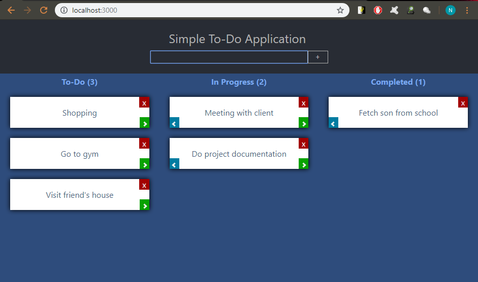

## Simple To-Do Application

This project is simple to-do application created from ReactJS

Run `npm start` to start the project

The project will load on a new browser on `localhost:3000`

The application is divided into three categories: `To-Do`, `In Progress` and `Completed`

This project was bootstrapped with [Create React App](https://github.com/facebook/create-react-app).
